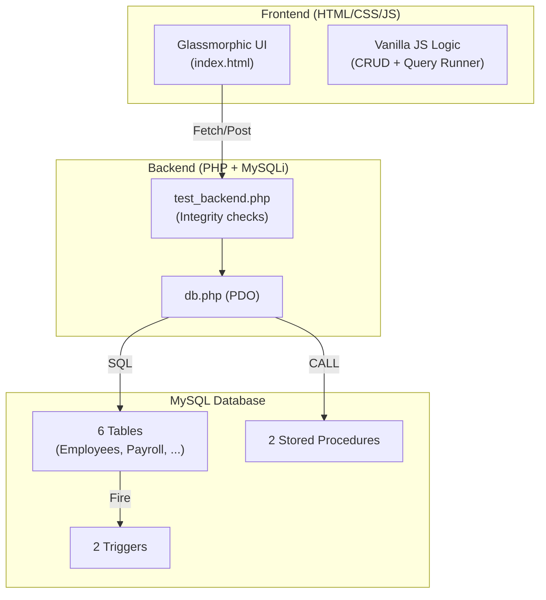
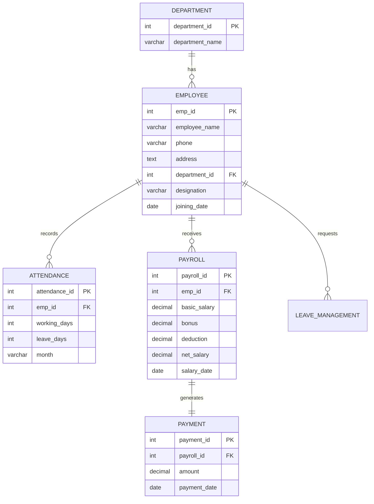
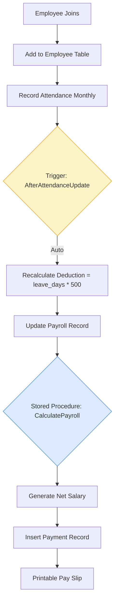
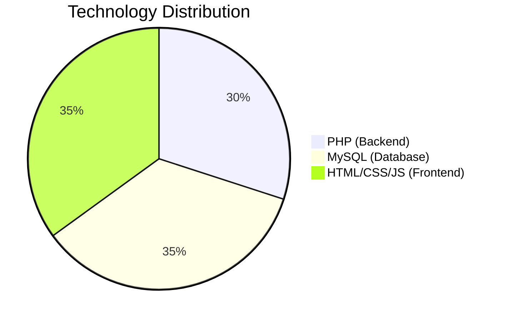

A Full-Stack DBMS Project with Real-Time Payroll Calculation, Stored Procedures, Triggers & Advanced SQL Queries


---

## 🏠 Feature Highlights

| Category            | Features                                                                                   |
|---------------------|--------------------------------------------------------------------------------------------|
| **Database Design** | 6 normalized tables (`Department`, `Employee`, `Attendance`, `Payroll`, `Payment`, `Leave_Management`) with foreign keys & cascade rules |
| **Stored Procedures** | `CalculatePayroll` (computes net salary) & `GetSalaryReport` (generates itemised payslip) |
| **Triggers**        | `AfterAttendanceUpdate` (auto‑updates deduction & net salary) <br> `BeforePayrollInsert` (blocks duplicate monthly payroll) |
| **10 Advanced SQL Queries** | Joins, subqueries, `GROUP BY`, `HAVING`, `NOT EXISTS` – all runnable from UI       |
| **Premium UI**      | Glassmorphic dark theme, micro‑animations, responsive layout, real‑time alerts             |
| **Live Dashboard**  | Employee count, department stats, salary overview                                          |
| **Invoice System**  | Printable pay slip generated via stored procedure                                          |
| **Full CRUD**       | Insert, Update, Delete on employees – with cascade to payroll & attendance                |

---

## 🧱 System Architecture



---

📊 Entity‑Relationship Diagram



---

🔁 Payroll Lifecycle Flowchart



---

📜 Stored Procedures & Triggers

Stored Procedures

Procedure Name Parameters Description
CalculatePayroll emp_id, basic, bonus, deduction, salary_date Computes net salary and inserts into Payroll table
GetSalaryReport emp_id Returns itemised payslip (basic, bonus, deduction, net)

Triggers

Trigger Name Event Action
AfterAttendanceUpdate AFTER UPDATE ON Attendance Recalculates deduction = leave_days * 500 and updates Payroll.net_salary
BeforePayrollInsert BEFORE INSERT ON Payroll Blocks duplicate payroll for same employee & month (SQLSTATE 45000)

---

🔟 The 10 Advanced SQL Queries

# Query Description SQL Concepts Used
1 List all employees with their departments INNER JOIN
2 Find employees who never took a leave LEFT JOIN, IS NULL
3 Total payroll amount per department GROUP BY, SUM, JOIN
4 Employee with the highest net salary ORDER BY, LIMIT
5 Count of employees per department COUNT, GROUP BY
6 Average salary by designation AVG, GROUP BY
7 Employees earning above department average Correlated subquery
8 Monthly salary trend (last 3 months) DATE functions, aggregation
9 Departments with total payroll < 1,00,000 HAVING clause
10 Departments that have no employees (NOT EXISTS) NOT EXISTS, subquery

(All queries are runnable from the Display & Queries section of the UI)

---

🚀 Quick Start Guide

Prerequisites

· PHP 8.0+ (with PDO MySQL extension)
· MySQL 8.0+
· Web browser (for frontend)

Step 1 – Set up the Database

```bash
# Clone your repo, then import schema
mysql -u root -p < database/schema.sql
```

Verify tables:

```sql
USE payroll_system;
SHOW TABLES;
-- Expected: Department, Employee, Attendance, Payroll, Payment, Leave_Management
```

Step 2 – Configure Backend

Edit backend/db.php with your MySQL credentials:

```php
$host = 'localhost';
$db   = 'payroll_system';
$user = 'root';
$pass = 'your_password';
```

Run the test suite to verify everything:

```bash
cd backend
php test_backend.php
```

You should see all [PASS] messages.

Step 3 – Launch Frontend

Simply open frontend/index.html in your browser (no build step).
The UI runs on an in‑memory dataset (for demo) but is ready to connect to your real backend via AJAX.

---

🧪 Testing Triggers (Demo)

Trigger 1 – Auto Salary Update

1. Go to Trigger Demo section in the UI.
2. Select an employee and change their Leave Days.
3. Click “Update Leaves & Fire Trigger” – you’ll see deduction and net salary recalculated instantly.

Trigger 2 – Duplicate Payroll Prevention

1. Still in Trigger Demo.
2. Click “Force Insert Duplicate Payroll”.
      The UI shows a simulated SQLSTATE 45000 error – exactly what the real database trigger would raise.

---

🎨 Tech Stack Summary



---

🤝 Contributing

1. Fork the repository
2. Create a feature branch (git checkout -b feature/amazing-feature)
3. Commit your changes (git commit -m 'Add some amazing feature')
4. Push to the branch (git push origin feature/amazing-feature)
5. Open a Pull Request

---

📄 License

Distributed under the ISC License. See LICENSE file for more information.

---

Built with ❤️ by Monisha Devadiga – A DBMS Project for the Database Systems Course
